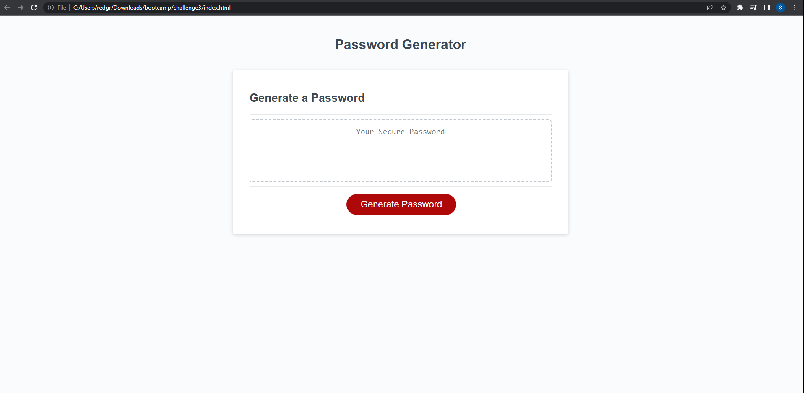

# Password Generator Starter Code

## Description 

The purpose of creating this password generator is to further familiarize myself with JavaScript and how to use JavaScript to generate random characters. I was able to use JavaScript to not only generate random characters, but to also guard against potential errors that may occcur during the user's experience. The movtivation behind this project was to gain experience in how to use JavaScript to include more user interaction with the websites we've built so far. This helps to solve the problem of making our current website more functional for users. Through this project I learned how to create empty arrays and strings for user's to input data, and use that input data to return the desired outcomes requested by the user. 

## Installation

No installation is required to view this password generator. Here is a link to the deployed website:
https://seanbl.github.io/Challenge3/

## Usage

The following image shows the web application's appearance and functionality:

The password generator displays a button to begin the process of generating a random password. The user will be given a series of prompts to determine the length of the password and the character criteria. Once all the prompts have been answered, a random password will be generated and displayed on the webpage.

**Note**: This layout was intended for desktop viewing. The images may not display properly on smartphones or tablets. 

## Credits

N/A

## License

N/A